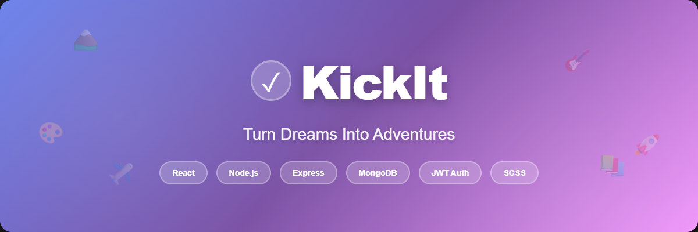

# KickIt



**KickIt** is a full-stack bucket list adventure tracking application that helps users create, manage, and celebrate their life goals. Turn your dreams into actionable adventures with target dates, location tracking, progress notes, and completion milestones.

## Why KickIt?

Life is full of adventures waiting to happen, but they often get lost in the chaos of daily routines. KickIt was built to transform vague aspirations into concrete plans. Whether it's skydiving in New Zealand, learning guitar, or writing a novel, KickIt keeps your bucket list organized and motivates you to make every moment count.

## Features

### Core Functionality (MVP)

- **Secure Authentication:** JWT-based user registration, login, and session management
- **Adventure Management:** Full CRUD operations to create, view, edit, and delete bucket list items
- **Categorization:** Organize adventures by type (Travel, Skills, Experiences, Personal, Other)
- **Status Tracking:** Mark adventures as "Planned" or "Completed" with automatic completion date logging
- **Location & Target Dates:** Track where and when you want to accomplish each adventure
- **Progress Notes:** Add, edit, and delete comments to document your journey toward each goal
- **Mobile-First Design:** Responsive grid layout optimized for all screen sizes
- **User-Specific Data:** Only see and manage your own adventures with authorization enforcement

### User Experience

- Pre-filled edit forms for seamless updates
- Intuitive navigation with username display in navbar
- Accessible design meeting WCAG 2.0 AA standards
- Clean, modern UI with consistent theming and styled components

## Getting Started

### Live Application

**Deployed App:** [KickIt on Netlify](https://your-app-url.netlify.app)

### Planning Materials

- **Trello Board:** [KickIt Project Planning](https://trello.com/invite/b/690937c380b75a5b233d3fd2/ATTI11ba6df8fb2f176390ace72ff968c0447114D6CD/kickit)
- **Wireframes:** See Trello board for mobile-first UI designs
- **ERD:** See Trello board for database schema

### Backend Repository

**Backend API:** [KickIt Backend on GitHub](https://github.com/evanmarshall-dev/kickit-backend)

## Technologies Used

### Frontend

- **React** - Component-based UI library
- **React Router** - Client-side routing
- **Context API** - Global state management for authentication
- **SCSS** - Styling with 7-1 architecture and CSS Modules
- **Axios** - HTTP client for API requests

### Backend

- **Node.js** - JavaScript runtime
- **Express** - Web application framework
- **MongoDB** - NoSQL database
- **Mongoose** - MongoDB ODM
- **JWT** - Token-based authentication
- **bcrypt** - Password hashing

### Deployment

- **Frontend:** Netlify
- **Backend:** Heroku
- **Database:** MongoDB Atlas

## Installation & Setup

### Prerequisites

- Node.js (v14 or higher)
- pnpm or yarn
- MongoDB Atlas account (or local MongoDB)

### Local Development

1. **Fork then Clone the repository**

   ```bash
   git clone https://github.com/yourusername/kickit-frontend.git
   cd kickit-frontend
   ```

2. **Install dependencies**

```bash
   pnpm install
```

3. **Create environment variables**

   Create a `.env` file in the root directory:

   ```
   VITE_BACK_END_SERVER_URL=http://localhost:1986
   ```

4. **Start the development server**

   ```bash
   pnpm dev
   ```

5. **Set up the backend**

   Follow instructions in the [backend repository](https://github.com/evanmarshall-dev/kickit-backend) to run the API locally.

## Project Structure

```
kickit-frontend/
├── public/
├── src/
│   ├── components/       # Reusable UI components
│   ├── pages/           # Page-level components
│   ├── context/         # Context API for state management
│   ├── services/        # API service functions
│   ├── styles/          # SCSS with 7-1 architecture
│   │   ├── abstracts/   # Variables, mixins, functions
│   │   ├── base/        # Reset, typography, base styles
│   │   ├── components/  # Component-specific styles
│   │   ├── layout/      # Layout patterns
│   │   ├── pages/       # Page-specific styles
│   │   └── main.scss    # Main SCSS entry point
│   ├── utils/           # Helper functions
│   ├── App.js
│   └── index.js
├── .env
├── package.json
└── README.md
```

## Attributions

- **Icons:** [Lucide React](https://lucide.dev/) - Open-source icon library
- **Fonts:** [Google Fonts](https://fonts.google.com/)
- **Design Inspiration:** Modern bucket list and goal-tracking applications

## Next Steps (Planned Enhancements)

### Phase 1: Enhanced UX

- [ ] Priority levels (low/medium/high) for adventures
- [ ] Progress bar showing overall completion percentage
- [ ] Confetti animation on adventure completion
- [ ] Advanced filtering by status, category, and date
- [ ] Search functionality for quick adventure lookup

### Phase 2: User Profile & Social Features

- [ ] User profile page with avatar and bio
- [ ] Adventure statistics dashboard (completion rate, trends)
- [ ] Public adventure sharing (view-only links)
- [ ] Friend sharing capabilities

### Phase 3: Advanced Features

- [ ] AWS S3 integration for adventure photos
- [ ] Redux for complex state management
- [ ] Achievement badge system
- [ ] Calendar integration for target dates
- [ ] Export adventures as PDF

---

**Built with ❤️ by Evan Marshall**
_Full-Stack Software Engineering Capstone Project - 2025_
